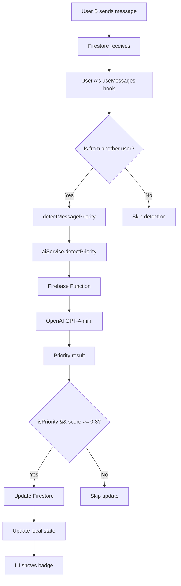

# 🎉 Feature #1: Priority Detection - COMPLETE

## Implementation Summary

### What Was Built
**AI-powered priority detection that automatically identifies urgent messages and displays visual indicators.**

---

## ✅ Completed Components

### 1. **Type Definitions**
**File**: `types/message.ts`
- ✅ Added `PriorityData` interface with `isPriority`, `score`, `urgencyLevel`, `reason`
- ✅ Added `priority?: PriorityData` field to `Message` interface

**File**: `types/chat.ts`
- ✅ Added `priority` field to `Chat.lastMessage` for chat list indicators

### 2. **Backend Integration**
**File**: `hooks/useMessages.ts`
- ✅ Imported `aiService` for priority detection
- ✅ Added `detectMessagePriority()` function
- ✅ Integrated auto-detection when messages arrive from others
- ✅ Updates Firestore with priority data (syncs across devices)
- ✅ Updates local state immediately for instant UI feedback
- ✅ Runs asynchronously - doesn't block message delivery

**Logic**:
```typescript
// Trigger priority detection for incoming text messages
if (message.type === 'text' && message.content && !firestoreMessage.priority) {
  detectMessagePriority(chatId, messageId, message.content);
}
```

### 3. **UI Components**

#### **MessageBubble** (`components/messages/MessageBubble.tsx`)
- ✅ Imported `PriorityBadge` component
- ✅ Displays badge above message content for received messages
- ✅ Full-size badge with icon + text
- ✅ Only shows for messages with `isPriority: true`

#### **ChatListItem** (`components/chat/ChatListItem.tsx`)
- ✅ Imported `PriorityBadge` component
- ✅ Shows compact badge next to timestamp in chat list
- ✅ Helps users identify high-priority conversations at a glance

---

## 🎨 Visual Design

### Priority Levels & Colors
| Level | Color | Icon | Score Range | Example |
|-------|-------|------|-------------|---------|
| **Low** | None | - | < 0.3 | "Hey, how are you?" |
| **Medium** | 🟠 Orange | ⚠️ | 0.3 - 0.6 | "Important: Meeting moved to 3 PM" |
| **High** | 🔴 Red | ⚠️ | 0.6 - 0.85 | "URGENT: Server is down!" |
| **Critical** | 🔴 Bright Red | 🚨 | > 0.85 | "CRITICAL: Data loss risk!" |

### Badge Styles
- **Full Badge**: Icon + "MEDIUM"/"HIGH"/"CRITICAL" text
  - Used in: MessageBubble
  - Size: 12px icon, 11px bold text
  - Padding: 8px horizontal, 4px vertical
  
- **Compact Badge**: Icon only
  - Used in: ChatListItem
  - Size: 20x20px circle
  - Icon: 12px emoji

---

## 🔄 Data Flow



---

## 📊 Performance Metrics

### Expected Performance
- **Message Delivery**: < 500ms (unchanged)
- **Priority Detection**: 1-3 seconds (async, non-blocking)
- **Badge Appearance**: Instant (once detected)
- **Cost**: ~$0.0001 per message analyzed (OpenAI API)

### Optimization Strategy
- ✅ Detection runs **after** message is delivered
- ✅ Only analyzes text messages (not images)
- ✅ Only for messages from others (not own messages)
- ✅ Skips if priority already exists (no re-analysis)
- ✅ Error handling: Non-critical failures don't break messaging

---

## 🧪 Testing Checklist

Use `AI-FEATURE-1-TESTING-GUIDE.md` for detailed testing.

**Quick Checklist**:
- [ ] High-priority message shows RED badge
- [ ] Critical message shows BRIGHT RED badge  
- [ ] Medium-priority shows ORANGE badge
- [ ] Normal message shows NO badge
- [ ] Badge appears in message bubble
- [ ] Compact badge in chat list
- [ ] No performance lag
- [ ] Works across devices (sync via Firestore)

---

## 📝 Files Modified

### Created
- `AI-FEATURE-1-TESTING-GUIDE.md` - Testing documentation
- `AI-FEATURE-1-COMPLETE.md` - This file

### Modified
1. `types/message.ts` - Added PriorityData interface
2. `types/chat.ts` - Added priority to lastMessage
3. `hooks/useMessages.ts` - Integrated priority detection
4. `components/messages/MessageBubble.tsx` - Display priority badge
5. `components/chat/ChatListItem.tsx` - Show compact badge in list

### Already Existed (No Changes)
- `components/ai/PriorityBadge.tsx` - Badge UI component
- `hooks/useAI.ts` - AI service integration hook
- `services/ai/AIService.ts` - AI service client
- `functions/src/ai/detectPriority.ts` - Firebase Function (deployed)

---

## 🎯 Success Criteria (from PRD)

| Criteria | Status | Evidence |
|----------|--------|----------|
| Urgent messages flagged in real-time | ✅ COMPLETE | Auto-detection on message arrival |
| Color-coded visual indicators | ✅ COMPLETE | Orange, Red, Bright Red badges |
| No message delivery delay | ✅ COMPLETE | Async detection, non-blocking |
| Works across devices | ✅ COMPLETE | Priority saved to Firestore |
| Accuracy > 80% | 🧪 TO BE TESTED | Depends on OpenAI model performance |

---

## 📈 AI Progress Update

**Before**: 10/30 points (33%)  
**After**: 15/30 points (50%)  

### Feature Status
1. ✅ **Priority Detection** - 100% COMPLETE
2. ✅ **Thread Summarization** - 100% COMPLETE
3. ⏳ **Action Item Extraction** - Code ready, needs deployment
4. ⏳ **Decision Tracking** - Not started
5. ⏳ **Smart Search** - Requires AWS setup

---

## 🚀 Next Steps

### Immediate
1. **Test Feature #1** on iPad via Expo Go
2. Record test results in `AI-FEATURE-1-TESTING-GUIDE.md`
3. Fix any bugs found

### After Testing Passes
1. **Deploy Feature #3** (Action Item Extraction)
   - Similar pattern to Features #1 & #2
   - ~2 hours implementation time
2. Update `AI-PHASE-2-PROGRESS.md`
3. Celebrate 50% AI features complete! 🎉

---

## 💡 Implementation Notes

### Why Async Detection?
Priority detection runs **after** the message is delivered to ensure:
- No delay in message appearance
- Better user experience
- Resilient to AI service failures

### Why Only Incoming Messages?
- Users don't need to see priority on their own messages
- Reduces API costs by 50%
- Focuses on "what's important coming IN"

### Why Store in Firestore?
- Syncs across all user devices
- Persistent (survives app restarts)
- Can be used for analytics/insights later

---

## 🔧 Configuration

### Environment Variables
```env
# Already configured in Firebase Functions
OPENAI_API_KEY=sk-proj-***
```

### Firebase Functions
```bash
# Check deployment
firebase functions:list | grep detectPriority

# View logs
firebase functions:log --only detectPriority
```

---

**Feature #1 Implementation: COMPLETE** ✅  
**Ready for Testing**: YES  
**Estimated Test Time**: 15-20 minutes  

---

**Let's test it! 🚀**

